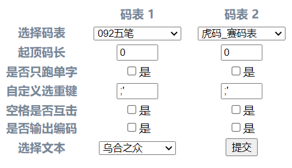

# gosmq 的一个前端

直接双击打开或者不带参数的命令行为 web 模式，带参数的命令行为 cli 模式

> `SmqIn.Ding`字段不为 0 时，会自动输出赛码表

## web

### 预览



### 用法

1. 将文本放到程序运行目录下的 text 文件夹下
2. 码表放到 dict 文件夹下
3. 双击打开程序

## cli

### 预览


### 用法

```shell
smq.exe [OPTIONS]

Application Options:
  /i, /input:    []string       码表路径，可设置多个
  /d, /ding:     int    普通码表起顶码长，码长大于等于此数，首选不会追加空格
  /s, /single    bool   是否只跑单字
  /t, /text:     string 文本
  /c:            string 自定义选重键(2重开始) (default: ";'")
  /k             bool   空格是否互击
  /o, /output    bool   是否输出结果
  /v, /version   bool   查看版本信息

Help Options:
  /?             Show this help message
  /h, /help      Show this help message
```

### 例子

赛码表：`-i dictpath -t textpath`

普通码表：

- 四码定长：`-i dictpath -d=4 -t textpath`
- 二码顶功：`-i dictpath -d=2 -t textpath`
- 不定长：`-i dictpath -d=99 -t textpath`

多个码表同时测试：`-i dict1 -i dict2 -i dict3 -t textpath`
